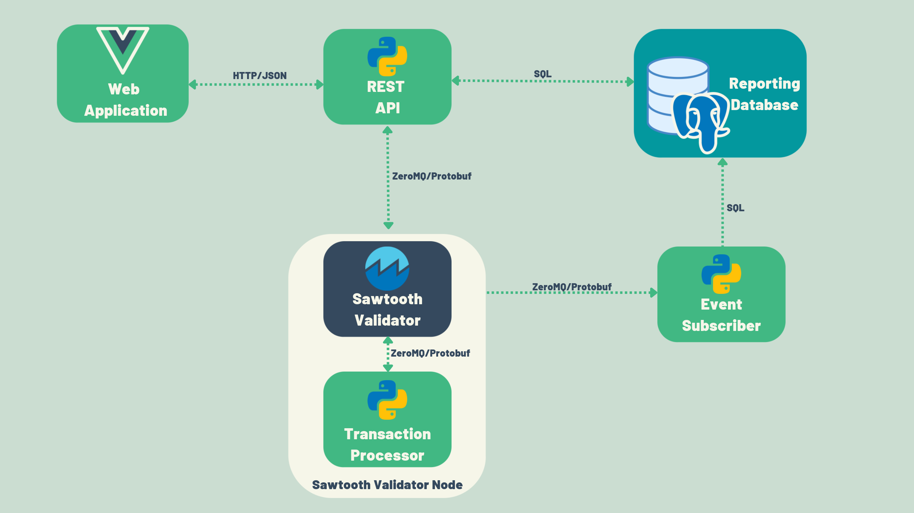
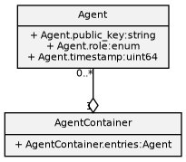
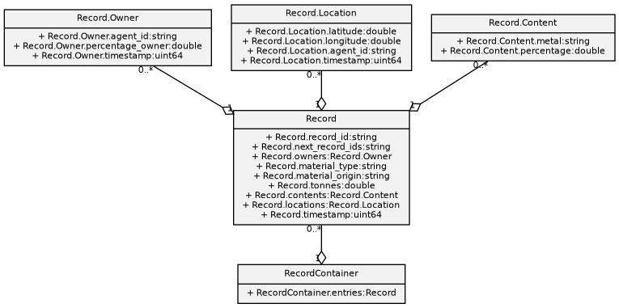
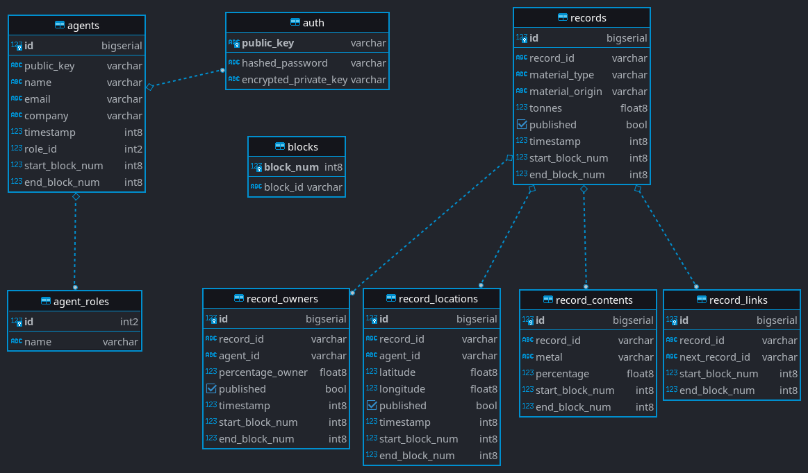

# Metal Supply

## Usage

### Backend

To run the application, navigate to the project's root directory, make sure you have docker running, then use
this command to build the containers:

```bash
docker-compose -f sawtooth-default.yaml up
```

Stop the containers before every run with:
```bash
docker-compose -f sawtooth-default.yaml down
```

### Frontend
To run the frontend navigate to folder metal_supply_app and run:

```bash
npm run serve
```

### Check contents of DB

```bash
docker exec -it <hash> sh
```

```bash
psql -U sawtooth metal-supply
```


## System Design

This section covers the design decisions taken in the planning phase of the project.

### 1 Metal Supply Architecture Overview



The Metal Supply application includes these components:

- Transaction Processor. The transaction processor defines the business logic and validates 
    transactions. It is created using the Sawtooth Python SDK and thus it has built-in
    interfaces for simple communication with the Sawtooth Validator. Together the Transaction 
    Processor with the Sawtooth Validator make the Validator Node.
- Web Client. The web client is a lightweight single page application written using the
    JavaScript framework Vue.js. It has the capability to authenticate and authorize agents on
    the platform, submit transactions to register new agents, add new records, add record locations,
    transfer ownership of records, etc. Transactions are submitted as HTTP requests
    with JSON bodies to the REST API.
- Rest API. The REST API handles communication with the Validator node. It creates
    batches of transactions according to the requests submitted from the web client. It manages 
    the public/private keys, kept in a reporting database, and signs transactions with
    them. Also queries the reporting database when a request for retrieval of information is
    received from the Web Client.
- Event Subscriber. The event subscriber handles all the delta changes in the state data. It
    subscribes to the Validator Node in order to receive the state data changes as events and
    in turn update the reporting database.

### 2 Design Requirements And Planning

#### 2.1 Permissioned vs Permissionless

The Metal Supply application is meant to be a platform that meets companies’ supply chain
needs. In addition, it is focused on recycling products and creating closed-loop systems for
recycling products. With regards to having different companies cooperating with each other,
the choice of blockchain category was straightforward. It needs to be a permissioned network
for the possibility of having different levels of visibility of the blockchain data that does not
need to be necessarily public. Having permission to record transactions on the blockchain
should be kept only in the hands of the people managing their companies’ supply chain. This
permission could also be used by IoT devices that can record relevant information for the supply
chain, such as location.

#### 2.2 Interaction with the Blockchain network

The application will certainly need a client-facing user interface that will be used for supply
chain management. Most front-end technologies will suffice regarding a simple, easy-to-use
and intuitive user interface. However, integration with Google Maps is required to display
the location data for maximum engagement from the supply chain managers’ side. Hence, a
decision was made in the favour of the popular JavaScript framework - Vue.js

#### 2.3 Off-Chain Storage

The application also needs a reporting database. The function of the reporting database is two-
fold. Firstly, it serves as a place where we can store company-specific information that does
not need to clutter the data models of the blockchain. The company-specific information will
also be easily erasable in case a partner leaves the platform. Secondly, it serves as a much
faster way for querying information instead of calling the blockchain nodes every time we

need some information. A choice was made in favour of a relational DBMS for development
purposes but in an industry-grade application ready for deployment, a NoSQL DBMS will be
more appropriate where the data will be replicated, sharded and distributed to the validating
nodes of the company that owns the data.

#### 2.4 Modular Design

The back-end systems that make everything possible need to be highly modular and be able to
be deployed and run on a variety of computers without extensive configuration of the specific
environment. For that very reason, we need to enforce the separation of the back-end systems
and build it using a micro-service architecture where different components will interact with
each other through prespecified channels of communication. For the aforementioned reasons
we need to build the components into Docker containers because they are very flexible and
allows deployment of applications in separate containers independently and in different lan-
guages. It also reduces the risk of conflict between languages, libraries or frameworks when
they are containerized.

#### 2.5 Client vs Server Signing Model

When using a REST API there is a consideration to be made of what signing model is the most
appropriate for the use case. Like everything else in computer science, both models have their
caveats.

Client signing model

The workflow of using a client signing model requires the client to be able to build (batches
of) transactions and sign them using the user’s private key. Then the client should serialize the
batches and send them to a single POST endpoint to the REST API which will directly send
it to the validator. The REST API in this case is only a mediator between the client and the
validator.
The advantage of this model is that transactions are signed locally using the user’s private
key and thus their identity is fully verifiable. Even in the event that the server is fully compro-
mised, there is no way to falsify transactions.
The disadvantage of this model is the rest api only contains 1 endpoint for submitting
transactions and thus does not follow RESTful standards instead of supporting the full CRUD
array of manipulations for a given entity. Another disadvantage is that every client needs to
implement transaction creation, serialization and signing functionality.
This model leaves the responsibility to the users to protect their own private key and requires
the use of rich clients. Sawtooth provides a default REST API which only submits transactions
which are already serialized. However, this is not the signing model this project follows and
thus a custom REST API is needed.

Server signing model

The Server signing model abstracts the transaction signing from the clients by putting it in
the REST API. The client submits update requests as JSON objects to traditional RESTful
endpoints. Then the server creates and signs transactions based on the submitted JSON and
also handles batching and serialization. At the end, it sends the transaction to the validator.
The advantage of this approach is that the server maintains a RESTful interface, which
means that the interaction with the server is no different than if the server was backed by a
traditional database. Consequently, this simplifies the clients because they don’t have to handle
transaction creation, serialization, deserialization and signing.
The disadvantage of this approach comes from the need for a server to sign transactions
which somehow compromises the identity verification of a blockchain. A na ̈ıve approach of
this signing model would be having a single private key for signing all transactions. This will
negate all the identity verification advantages of blockchain because the server would be the
single source of truth, the same as with a traditional database.
A more robust solution can be achieved by generating a public/private key pair for each user
on the server and storing the (encrypted) private key in a traditional database (ideally an addi-
tional key escrow service is recommended but this project does not implement this additional
security measure). The server can then retrieve and decrypt the private key of an authenticated
user and sign transactions on their behalf. While this is better than the na ̈ıve approach, it is
only as secure as the server’s security mechanisms. The Metal Supply application uses this
approach.

### 3 Application Design

Before going into the specific components, it is essential to go through the application design.
In the Metal Supply application records are the metal products that are tracked throughout
the supply chain, whereas agents are the users of the system, or in other words, the agent is the
supply chain manager. The Transaction payload is the set of fields provided to the Transaction
Processor in order to update the state.

#### 3.1 GDPR Compliance

There have been considerations about adding additional information about the agent/record in
the blockchain state. Information such as name, phone, company, etc. This is the intuitive
solution when designing a normal database schema. However, blockchain has an additional
property that makes it unique - immutability. Consider the situation when an agent has been
using the system for years but decides to leave the platform. Under Article 17 the data subject
shall have the right to obtain from the controller the erasure of personal data concerning him
or her[22]. Hence, we are required to delete everything that can be used to identify directly
or indirectly someone on the blockchain. This consideration led to the offloading of personal
information to an off-chain database which is also used for reporting purposes. That way
records on the blockchain could not be linked to real users. In the case of a request for the
erasure of personal data, we could easily delete the rows in the reporting database about the
given user.

#### 3.2 State Data Models

Payload Serialization and Deserialization

The validator sees the data as simply a string of bytes. Only the transaction processor that
handles the transaction will deserialize the payload. When interacting with the blockchain, a
transaction processor sets and retrieves state data by making calls against a version of state at a
specific address that the validator provides.
Likewise, when a client sends a transaction to the validator, it must serialize the payload
data. For this reason, the encoding scheme must be deterministic; serialization and deserializa-
tion must always produce the exact same results.
Consequently, all data models in the Metal Supply application are defined using protocol
buffers (protobufs) to encode all objects before storing them in the state (both payloads and
state data). Metal Supply uses protobufs to serialize batches and transactions because they
serialize and deserialize identically for the purposes of the project.

##### Agent Data Model



Each agent has a public and private key associated with them. Keep in mind that private keys
are not stored in the state(the blockchain), instead it is encrypted and stored in an off-chain
database. The agent can be 1 of 3 types - Waste Owner, Recycler, and Converter. A Waste
Owner is in a possession of end-of-life metal products. Recyclers are the ones separating

all the different metals inside the metal products. Converters take the separated metals and
convert them into new products. An agent can create, transfer and update records. The Agent
data model is defined in Figure 1.

##### Record Data Model


A record consists of many parameters that define the record. See Figure 2. A detailed expla-
nation of the fields can be found below:

- Record IDThe ID of the record
- List of Next Record IDsThe record ids of all records that were made as a result of this
    record
- List of Record OwnersA List of all the owners of a given record. Each Record Owner
    has the following fields:
       - Agent ID- The public key of the agent
       - Percentage Owner- The percentage of ownership of the record by the agent
       - Timestamp- Timestamp of an agent becoming an owner of the record
- Material TypeThe type of material
- Material OriginThe origin where the material come from.
- TonnesThe weight of the record in tonnes
- List of Record ContentsA list of metal contents. Each metal content consists of a metal
    and the percentage of that metal in the record.
- List of Record Locations- All locations of a given record. A Location consists of:
    - Latitude and Longitude- The geographical coordinates of the record
    - Agent ID- Public key of the agent that owns the location because a record could
       have more than 1 owner.
    - Timestamp- Timestamp of the when the location was recorded.

    
##### Payload Data Model

Another essential data model that is required by the Transaction Processor is the Transaction
Payload. Do note that the signature of the agent(owner) is not part of the payload but it is
received by the transaction processor as well. We have 5 types of payloads:

- Create AgentThis payload only requires the agent’s name and role. The agent’s pub-
    lic/private keys are generated by the Transaction processor and send as an event to the
    subscriber.
- Create Record- This payload requires the record id which is generated by the rest api,
    the geographical coordinates, material type and origin, weight in tonnes and the contents
    of the record
- Update Record Location- The payload requires the record id for identifying the record,
    the geographical coordinates and the agent id that owns the location. The transaction will
    not be valid if the signer is not one of the owners of the record.
- Transfer Record- The payload requires the record id for identifying the record to be
    transferred, the public key of the receiving agent and a percentage to be transferred. The
    transaction is not valid if:
       - the signer is not one of the owners of the record or does not exist
       - the record does not exists
       - the receiving agent does not exist
- Link Record- The payload requires the two record ids of the records that will be linked.
    The transaction is not valid if:
       - either of the record ids is a non-existing record.
       - the signer is not one of the owners of the record.


#### 3.3 Database Schema



Before building the components, a database schema should be defined. See Figure 3. The
reporting database has three types of columns: a blocks table, on-chain tables, and off-chain ta-
bles. The blocks table represents all block numbers and hash ids. The on-chain tables represent
the data stored on the blockchain and analogically the off-chain tables - the data not stored on
the blockchain. All updates to the blocks and on-chain tables should happen atomically, within
a single database transaction. This ensures that the state of the blockchain remains consistent
with the database data.
Starting from the blocks table, it is meant to represent the history of block numbers and
hash IDs in the blockchain. The table is used for fork resolution to compare the block number
of a received event against its block ID. If a new event comes with a block number and a block
hash id that is in the blocks table, that means it is a duplicate block and we should ignore it.
In the case that only the block number is in the blocks table but the block hash id is different,
that means a fork is detected and we should delete all entries in the database which are greater
or equal to the block number and replace them with the new block data. Finally, when none
of them is in the blocks table, the state change is applied throughout the application-specific
tables.
Each table that represents on-chain data has a start and end block number columns. The
start block number identifies the block number where the data is taken from. The end block
number defines whether this is the most recent version of the data (value of max integer) or if
the data has been superseded by another block (value of the newer block number).
Theagents,agentroleandauthtables represents the agent data model on the blockchain.
Theagentroletable has a one-to-one mapping with theagentstable and represents the three
role ids and the corresponding name of the role - Waster Owner, Recycler and Converter. The
authtable stores off-chain data and has a one-to-one mapping with theagents. The table also
contains the information needed for authentication: public key, hashed password and encrypted
private key. Theagentstable includes both on-chain columns (e.g. publickey, role, timestamp)
and off-chain columns(name, email, company, hashedpassword).
The parent tablerecordsand child tablesrecordowners,recordlocations,recordcontents,
recordlinksrepresent the record data model on the blockchain. Every column in those tables
represents on-chain data except for the published column, in some of the tables, which repre-
sents whether the records are marketed on the website. All child tables have a many-to-one
relationship with the parent tablerecordsbecause a single record can have multiple locations,
owners, contents and links.

### 4 Choice of Consensus

Throughout the whole development and testing process, the Dev mode consensus algorithm
was used, provided by Sawtooth for exactly that purpose. It selects a random leader that writes
the transaction to the blockchain. After the system goes into production, there are many vari-
ables that need to be taken into consideration. For example, if the network is going to be used
by a small number of organisations in a consortium but not less than four, PBFT will provide
the best performance. On the other hand, if the network is used by a large consortium of or-
ganisations and/or open membership is required, the best consensus will be PoET. However,
in the same case, if the hardware on which the blockchain is going to be run does not support
a special CPU instruction set called Intel Software Guard Extensions (SGX), then the PoET
simulator is going to be the obvious choice. The great thing about the platform is that we can
swap the consensus algorithm dynamically even after the network goes into production. This
enables us to choose the best consensus algorithm depending on the maturity of the platform.
If the network is used by one company with a small number of nodes, maybe the dev mode
consensus is not a bad choice. After the nodes grow more than four or more organisations join,
we could switch to PBFT. When the network becomes even bigger, we could test how PoET
performs and choose a version supported by the available hardware.

### 5 Chapter Summary

This chapter describes the design requirements and the needed planning involved in the project.
It also provides detailed description of the data models used. The chapter also covers the architecture 
of the application, as well as choices made in the process of planning and development.


